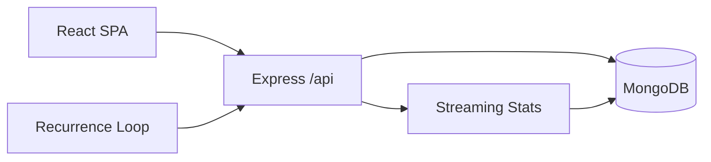

# 💰 Budget Tracker (Advanced Edition)

> A modern personal & group finance platform with smart insights, recurring automation, anomaly detection, and goal motivation — built with **React + TypeScript + Express + MongoDB**.

<p align="center">
  
  
  
</p>


---
## ✨ Highlights
- 🔐 **JWT Auth** – password-based, minimal & extensible.
- ♻️ **Recurring Transactions** – template engine materializes future expenses/income.
- 🚨 **Anomaly Detection** – streaming z‑score style heuristic (Welford variance) flags outliers.
- 🧮 **Financial Health Score** – composite scoring + recommendations.
- 🎯 **Savings Goals** – progress bars, urgency badge, success flair.
- 👥 **Group Balances & Settlement Suggestions** – netting algorithm for fair payouts.
- 📊 **Budgets & Reports** – monthly category tracking + charts.
- ⚙️ **Clean Architecture** – typed API, modular routes, scheduler, insights service.
- 🧪 **Deterministic Algorithms** – rolling stats, greedy settlement, recurrence advancement.

---
## 🗺️ Architecture Glimpse
Mermaid diagrams & deeper design live in [`docs/ARCHITECTURE.md`](docs/ARCHITECTURE.md).



---
## 🚀 Quick Start
### 1. Prereqs
- Node 18+
- MongoDB running locally (or connection string)

### 2. Install
```bash
# Backend
cd backend
npm install
# Frontend
cd ../frontend
npm install
```

### 3. Configure Backend `.env`
```env
MONGODB_URI=mongodb://localhost:27017/budgettrackr
JWT_SECRET=change-me
PORT=5000
NODE_ENV=development
```

### 4. Run Dev
```bash
# In backend/
npm run dev
# In frontend/
npm start
```
Navigate: http://localhost:3000 → Register → Explore.

### 5. Build Frontend (Prod)
```bash
cd frontend
npm run build
```
Serve `frontend/build` via static host / CDN; point it at backend API domain (configure CORS as needed).

---
## 🔐 Auth Flow (Password + JWT)
1. Register: returns `{ token, user }` immediately.
2. Store JWT (localStorage) → attach `Authorization: Bearer <token>` to protected calls.
3. Middleware verifies + hydrates `req.user`.
4. Token expiry default 7d (adjust in code/env).

---
## 🧠 Core Intelligence
| Feature | How It Works | Benefit |
|---------|--------------|---------|
| Recurrence | Interval loop queries templates by `nextRunAt` | Automates routine cashflow |
| Anomaly Detection | Welford mean/variance + threshold `> mean + 2σ` (n>5) | Surfaces unusual spending |
| Health Score | Weighted normalized components | Actionable personal finance pulse |
| Group Settlement | Greedy pairing of net positive/negative balances | Minimal settlement transfers |

---
## 📦 Domain Models (Simplified)
`User, Transaction (recurrence + anomaly), Goal, Budget, Group, Stats` — full ER diagram in docs.

---
## 🛣️ Roadmap (Excerpt)
- ✅ Goals panel animations
- ✅ Streaming anomaly tagging
- 🔜 Auto goal allocation
- 🔜 Settlement execution persistence
- 🔜 Real‑time (WebSocket/SSE) anomaly pushes
- 🔜 Export / import data

Full backlog: see inline comments + [`FEATURES.md`](FEATURES.md).

---
## 🧩 API Cheat Sheet
(Details & examples in [`docs/API_REFERENCE.md`](docs/API_REFERENCE.md))
```
POST /api/auth/register   -> { token, user }
POST /api/auth/login      -> { token, user }
GET  /api/auth/me         -> { user }

POST /api/transactions    # create (template or concrete)
GET  /api/transactions/anomalies
GET  /api/goals
GET  /api/insights/health
GET  /api/insights/checklist
GET  /api/groups/:id/settlements/suggest
```

---
## 🛠️ Development Tips
- Force a recurrence run: set a template's `nextRunAt` to past date and wait scheduler tick.
- Trigger anomaly: add 6 similar expenses then one large outlier.
- Urgent goal badge: create goal with deadline ≤ 14 days.

---
## 📚 Documentation Suite
| Doc | Purpose |
|-----|---------|
| [`docs/ARCHITECTURE.md`](docs/ARCHITECTURE.md) | Diagrams & system design |
| [`docs/SRS.md`](docs/SRS.md) | Requirements (functional & non‑functional) |
| [`docs/TECHNICAL_GUIDE.md`](docs/TECHNICAL_GUIDE.md) | Contributor setup & internals |
| [`docs/USER_GUIDE.md`](docs/USER_GUIDE.md) | End‑user walkthrough |
| [`docs/API_REFERENCE.md`](docs/API_REFERENCE.md) | Endpoint contracts |
| [`FEATURES.md`](FEATURES.md) | Feature deep‑dives & examples |

---
## 🧪 Algorithms Snapshot
<details>
<summary>Welford Streaming Stats</summary>

```text
Delta = x - mean
mean += Delta / count
Delta2 = x - mean
M2 += Delta * Delta2
variance = count > 1 ? M2/(count-1) : 0
stdDev = sqrt(variance)
```
</details>

<details>
<summary>Greedy Settlement (Concept)</summary>

1. Compute net balance per member.
2. Sort creditors (desc) & debtors (asc).
3. Match extremes; reduce amounts until zero.
4. Repeat until lists exhausted.
</details>

<details>
<summary>Recurrence Advancement</summary>

- Compute next date from frequency + interval.
- Decrement `occurrencesLeft` (if bounded) else continue.
- Deactivate when 0 or past `endDate`.
</details>

---
## 🧾 Security & Hardening Notes
- Bcrypt 12 rounds; rotate secret; consider rate limiting & lockout.
- Improve: move token to HttpOnly cookie + refresh flow for production.
- Limit anomaly endpoint exposure (auth already required).

---
## 🐞 Troubleshooting
| Issue | Hint |
|-------|------|
| Recurring not firing | Check `isTemplate`, `recurrence.active`, and `nextRunAt <= now` |
| No anomalies | Need ≥6 samples; outlier must exceed threshold |
| Auth 401 | Missing/expired token header |

---
## 🤝 Contributing
Internal / educational scope. For forks: open PRs with concise description + architectural impact notes.

---
## 📄 License / Notes
Internal project (adjust before production). Replace interval scheduler & basic anomaly heuristic as scale increases.

---
Built with ❤️ — iterate, extend, and keep finances intentional.
