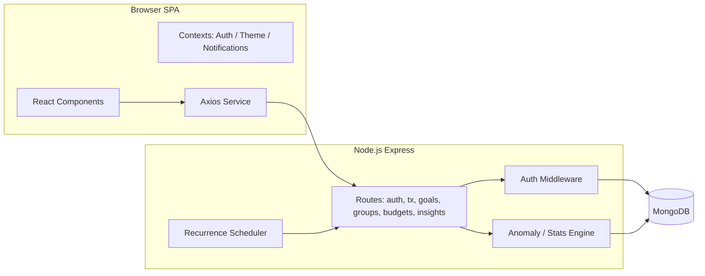
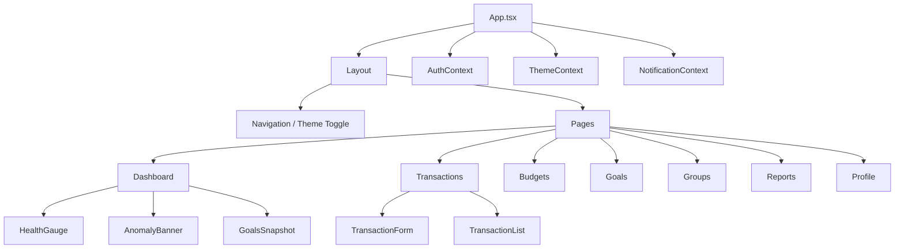
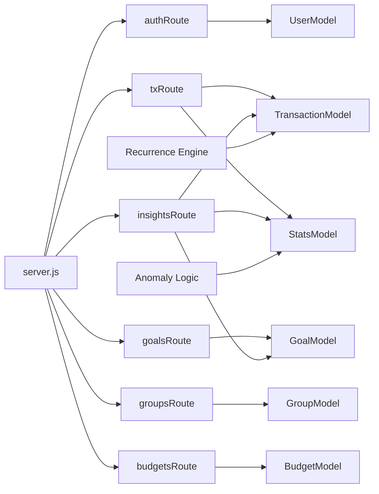
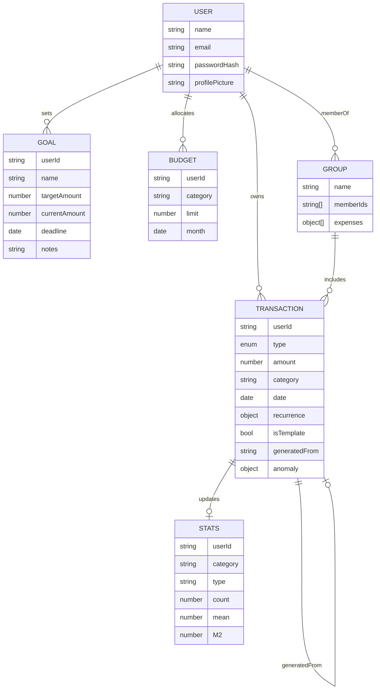
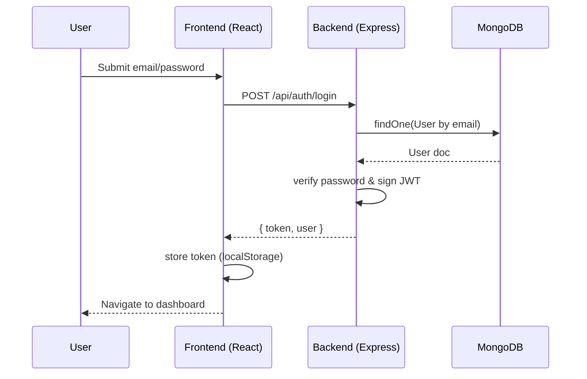
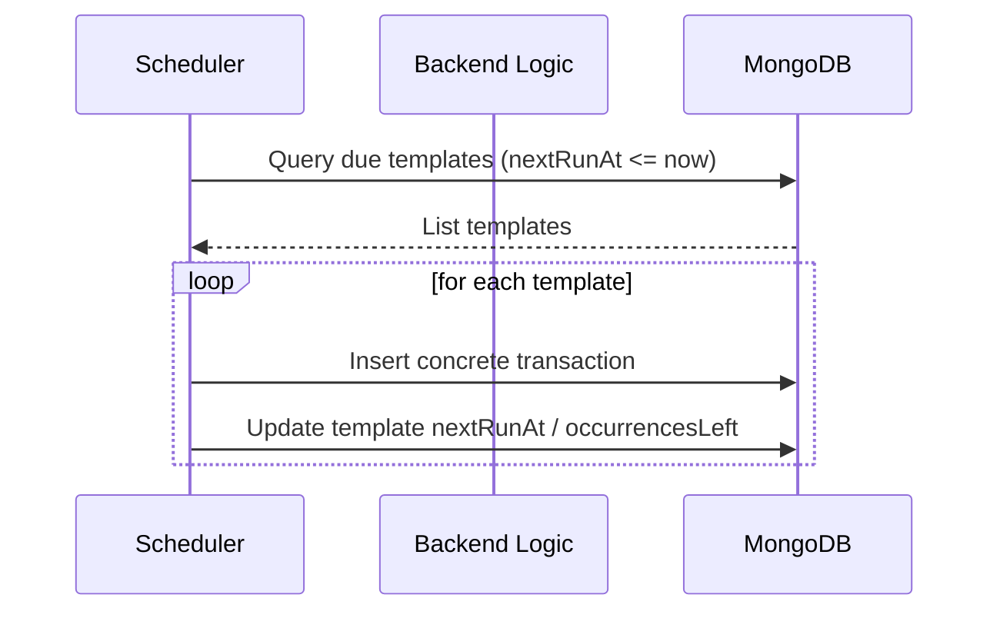
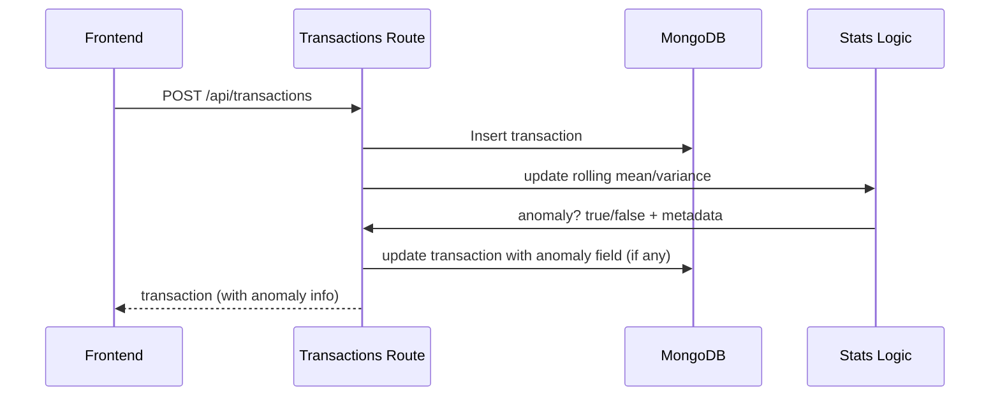

# Architecture & Design

## 1. High-Level System Overview
The Budget Tracker is a classic SPA + REST API stack:
- Browser (React SPA) communicates with Express backend via JSON.
- MongoDB persists domain entities.
- A lightweight in-process scheduler handles recurring transaction materialization.

## 2. Component Structure (Frontend)

## 3. Backend Module Diagram

## 4. Data Model Overview

## 5. Key Sequences
### 5.1 Login Flow

### 5.2 Recurring Transaction Materialization

### 5.3 Anomaly Detection on Insert

## 6. Deployment View
Single-process Node server + CRA dev server (or static build behind reverse proxy). For production: build frontend once, serve via CDN or static hosting, point to API domain with CORS allowed.

## 7. Cross-Cutting Concerns
| Concern | Approach |
|---------|----------|
| Auth | JWT Bearer, middleware validates and attaches `req.user` |
| Validation | Inline checks (could extend with schema lib later) |
| Security | Bcrypt hashing, secret-based JWT, CORS open (tighten in prod) |
| Observability | Heartbeat logs, request logs, anomaly & register/login logs |
| Scheduling | In-process `setInterval` (upgrade path: job queue) |

## 8. Known Limitations & Future
| Area | Limitation | Future Direction |
|------|------------|------------------|
| Scheduler | Single instance only | External worker / queue (BullMQ) |
| Auth Storage | localStorage token | HttpOnly cookie + refresh token flow |
| Anomalies | Basic z-score heuristic | Adaptive thresholds & category baselines |
| Groups | Settlement suggestion only | Persist & automate settlement postings |
| Budgets | Simple monthly cap | Rolling averages, predictive variance |

---
Version: 1.0  
Update this file as architecture evolves.
